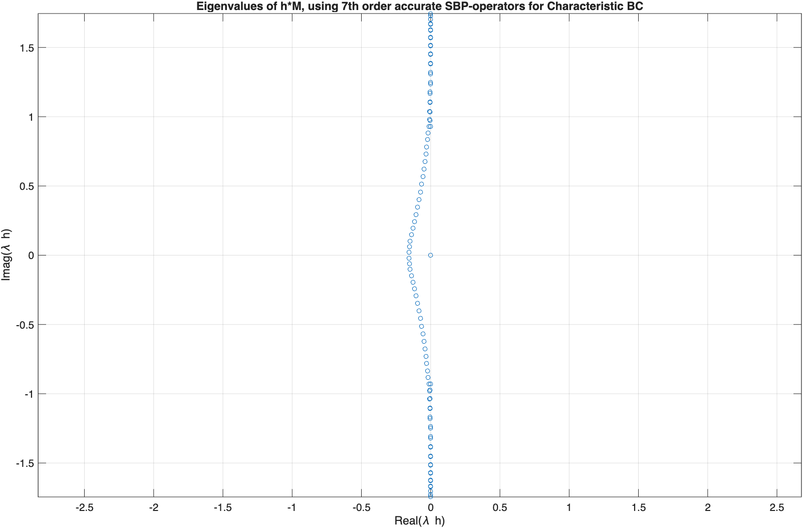
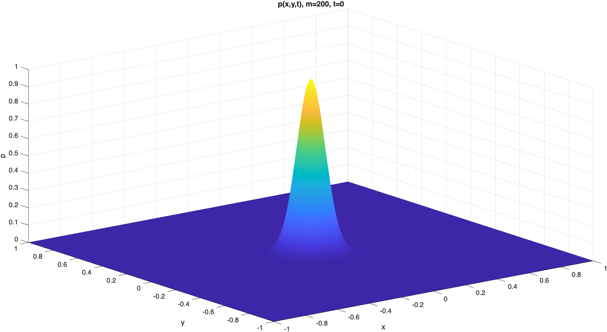
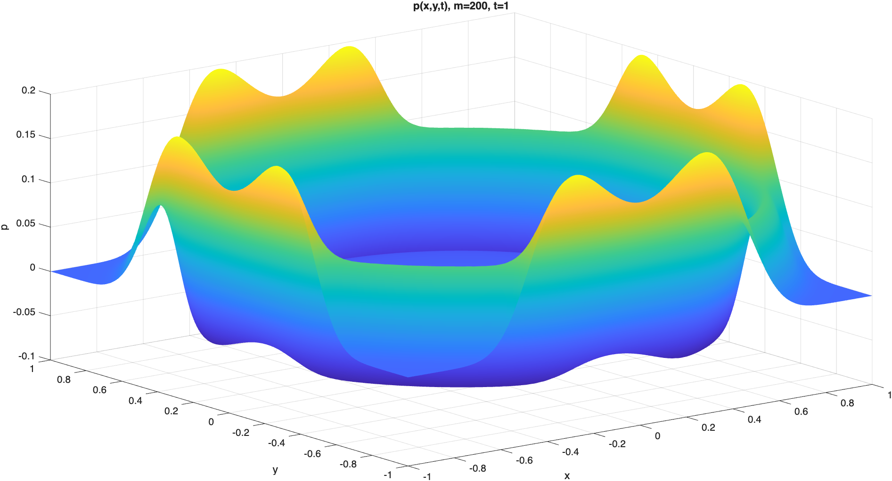
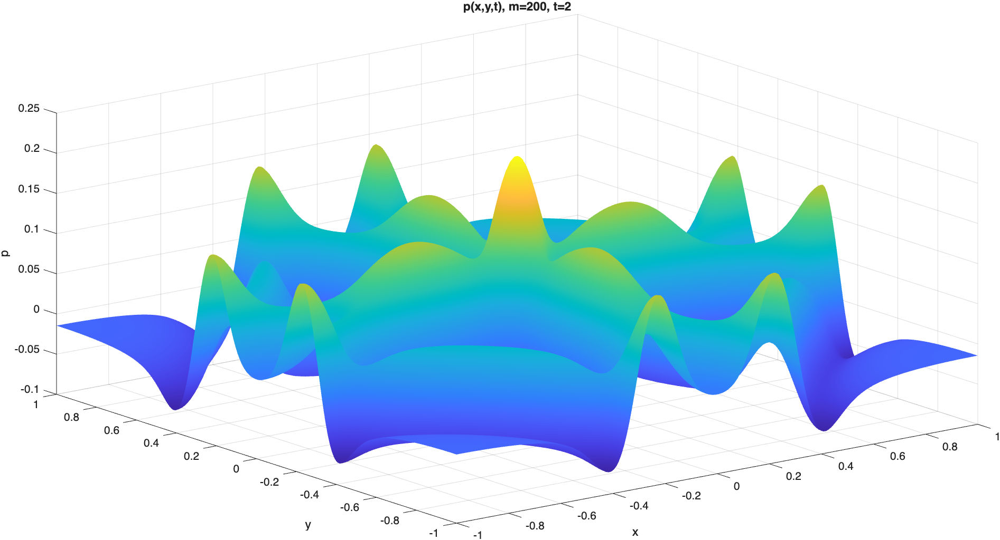
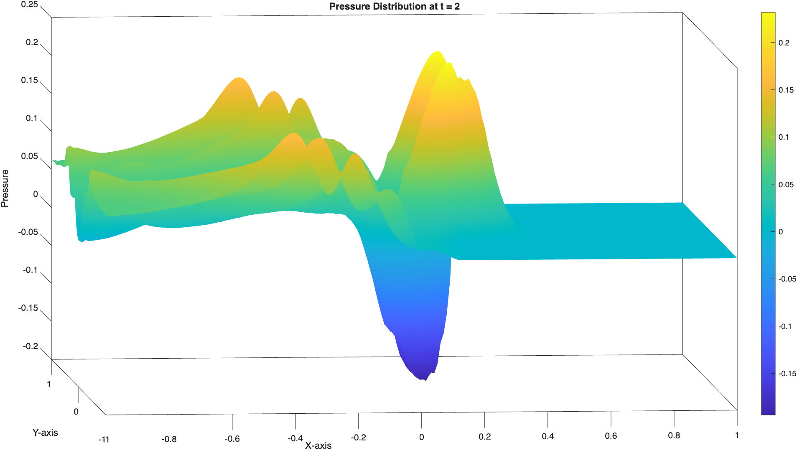
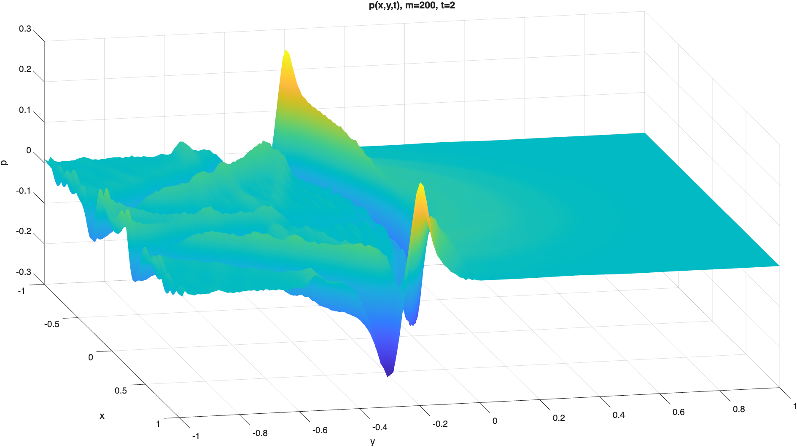
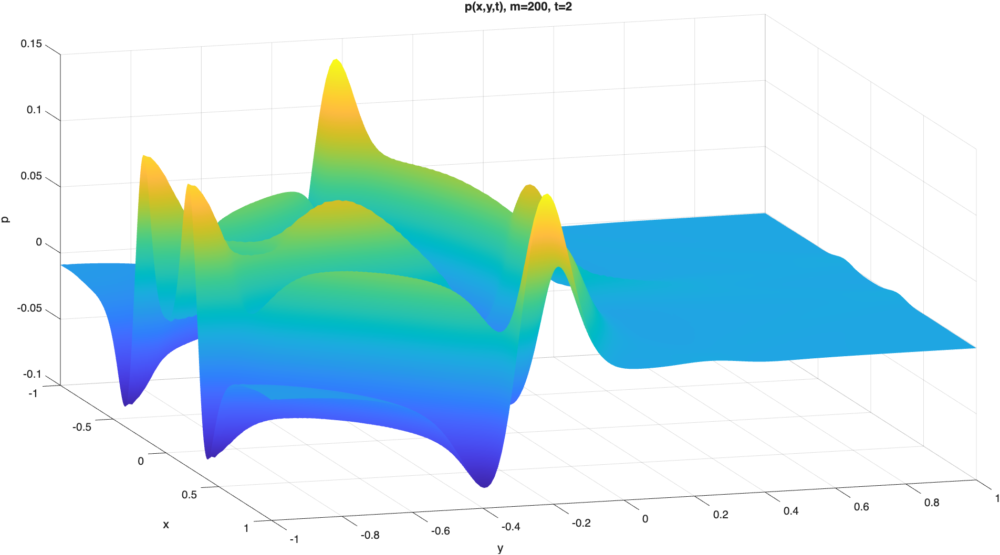
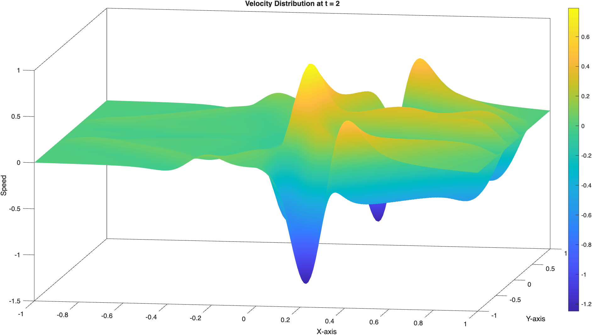

# High-order Acoustics with SBP–Projection (MATLAB)

High-order **SBP–Projection** finite-difference methods for the acoustic wave equation in **1D and 2D**, with emphasis on **stability**, **well-posed boundary/interface conditions**, **eigenvalue/CFL analysis**, and **RK4** time integration.

**Course:** 1TD354 — Scientific Computing for Partial Differential Equations  
**Institution:** Uppsala University  
**Language:** MATLAB

---

## Overview

This repository collects code and selected results from a course project on **provably stable** high-order finite-difference discretizations of the acoustic wave equation using **Summation-By-Parts (SBP)** operators combined with the **Projection method** for imposing boundary and interface conditions.

Key goals:
- Verify **well-posedness** of boundary conditions using energy arguments
- Construct **stable semi-discrete** operators via SBP–Projection
- Study stability via **eigenvalues** and derive **RK4 CFL** constraints
- Run time simulations in **1D and 2D**, including **heterogeneous media**
- Perform **convergence studies** (where applicable)

> This is a project codebase: focused on clarity and reproducibility rather than being a general-purpose solver library.

---

## Highlights

- ✅ SBP–Projection enforcement of boundary conditions (energy stable)
- ✅ Eigenvalue spectra of the semi-discrete operator (stability diagnostics)
- ✅ 2D implementation using **Kronecker products** and sparse matrices
- ✅ RK4 time stepping with practical CFL choices
- ✅ Wave propagation experiments (homogeneous + heterogeneous setups)

---

## Selected results

### Eigenvalue stability (semi-discrete operator)

  
  

  <em>Eigenvalues of h·M for characteristic vs. Dirichlet boundary treatments (example).</em>

---

### 2D pressure snapshots (Gaussian initial pressure)

<table>
  <tr>
    <td align="center" width="33%">
      
       <em>t = 0</em>
    </td>
    <td align="center" width="33%">
      
       <em>t = 1</em>
    </td>
    <td align="center" width="33%">
      
       <em>t = 2</em>
    </td>
  </tr>
</table>

  <em>Pressure field p(x,y,t) on Ω = [−1,1]×[−1,1] using SBP operators + RK4.</em>

---

### Heterogeneous media examples (selected)

  
  

  
  

  <em>Examples with piecewise material parameters (ρ, c) and absorption β.</em>

---

### Velocity example

  

  <em>Velocity distribution at t = 2 (example).</em>

---

## Model and discretization (short technical summary)

### 2D acoustic system (example form)
We work with a first-order system in 2D with state
`u = [p, v, w]^T` (pressure + velocities),
and a semi-discrete SBP–Projection formulation of the form:

- Construct SBP operators in x/y directions using Kronecker products:
  - `Dx = D ⊗ I`, `Dy = I ⊗ D`
- Enforce boundary conditions using a projection `P`
- Advance in time with RK4:
  - `u_t = - P * C^{-1} (Dx + Dy + D) * P * u`

Implementation uses **sparse matrices** throughout for performance.

---

